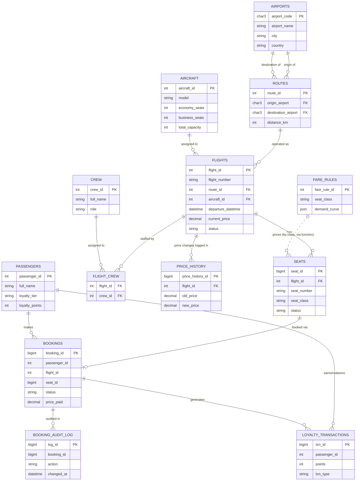

# Entity-Relationship Diagram — SkyLink Airlines

This renders automatically on GitHub (Mermaid support is built into
GitHub's Markdown viewer — no extra plugin or export needed).

The original Mermaid source (for use in non-GitHub tools like the
[Mermaid Live Editor](https://mermaid.live)) is also kept as
[`ER_diagram.mmd`](./ER_diagram.mmd) in this same folder.
